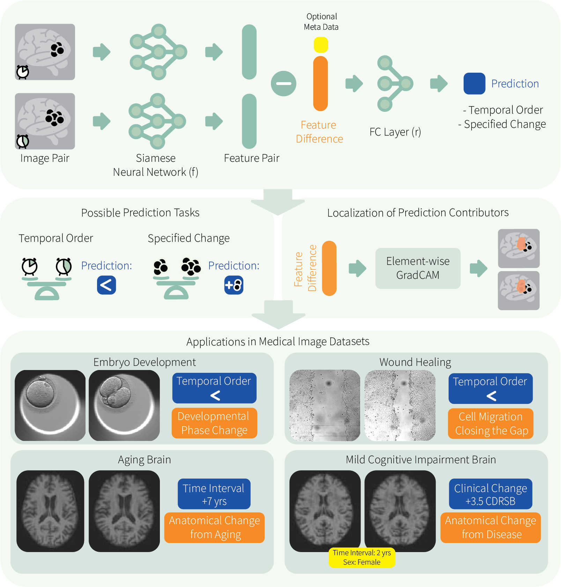

# Learning-based Inference of Longitudinal imAge Changes (LILAC)


## Overview

**LILAC** is a model that learns to compare images, designed to automatically filter out 
nuisance variations and focus on clinically significant changes in longitudinal imaging data.




This repository includes models and train/evaluation code for the LILAC paper. 

For more information, please read the [PNAS paper](https://www.pnas.org/doi/10.1073/pnas.2411492122). 
For questions and feedback, please [open issues](https://github.com/heejong-kim/lilac/issues) or email the [corresponding author](https://heejongkim.com).


## Installation
```bash
git clone https://github.com/heejong-kim/lilac.git
cd lilac
# if you prefer to use install in conda env
conda create -n lilac python pip 
conda activate lilac
pip install -e .

# If you would like to obtain the trained model weights described in the paper:
wget https://zenodo.org/records/14713287/files/lilac_model_weights.tar.gz
tar -xvzf ./lilac_model_weights.tar.gz
```

### Requirements
The LILAC package depends on the following requirements:
- torch
- torchvision>=0.11.2
- torchio>=0.18.73
- pandas>=1.3.4
- pillow>=8.4.0
- numpy>=1.21.2
- tensorboard
- scikit-learn

Running `pip install -e .` will automatically check for and install all of these requirements.

All baseline experiments in the paper were run on Python 3.9.7 and CUDA 11.2.


## Examples
### Learning to temporally order embryo images (LILAC-o)
```bash    
python run.py \
    --jobname='embryo' \
    --task_option='o' \
    --targetname='phaseidx' \
    --backbone_name='cnn_2D' \
    --batchsize=64 \
    --max_epoch=40 \
    --output_directory='./output' \
    --image_directory='./embryo_image_location' \
    --image_size='224,224' \
    --csv_file_train='./demo_for_release/demo_embryo_train.csv' \
    --csv_file_val='./demo_for_release/demo_embryo_val.csv' \
    --csv_file_test='./demo_for_release/demo_embryo_test.csv'
```
### Learning to temporally order wound-healing images (LILAC-o)
```bash
python run.py \
    --jobname='woundhealing' \
    --task_option='o' \
    --targetname='timepoint' \
    --backbone_name='cnn_2D' \
    --batchsize=128 \
    --max_epoch=40 \
    --output_directory='./output' \
    --image_directory='./woundhealing_image_location' \
    --image_size='224,224' \
    --csv_file_train='./demo_for_release/demo_woundhealing_train.csv' \
    --csv_file_val='./demo_for_release/demo_woundhealing_val.csv' \
    --csv_file_test='./demo_for_release/demo_woundhealing_test.csv'
```
### Learning to predict temporal changes (LILAC-t)
```bash
python run.py \
    --jobname='oasis-aging' \
    --task_option='t' \
    --targetname='age' \
    --backbone_name='cnn_3D' \
    --batchsize=16 \
    --max_epoch=100 \
    --output_directory='./output' \
    --image_directory='./oasis-aging_image_location' \
    --image_size='128,128,128' \
    --csv_file_train='./demo_for_release/demo_oasis-aging_train.csv' \
    --csv_file_val='./demo_for_release/demo_oasis-aging_val.csv' \
    --csv_file_test='./demo_for_release/demo_oasis-aging_test.csv'
```
### Learning to predict specific changes (LILAC-s)
```bash
python run.py \
    --jobname='adni-mci' \
    --task_option='s' \
    --targetname='CDRSB' \
    --optional_meta='AGExSEX'\
    --backbone_name='cnn_3D' \
    --batchsize=16 \
    --max_epoch=40 \
    --output_directory='./output' \
    --image_directory='./adni-mci_image_location' \
    --image_size='128,128,128' \
    --csv_file_train='./demo_for_release/demo_adni-mci_train.csv' \
    --csv_file_val='./demo_for_release/demo_adni-mci_val.csv' \
    --csv_file_test='./demo_for_release/demo_adni-mci_test.csv'
```
### Inference
Simply adding `--run_mode='eval'` will run inference on the testing set specified in the CSV file provided through `--csv_file_test=testset_list.csv`.
For example, 
```bash
python run.py \
    --jobname='adni-mci' \
    --task_option='s' \
    --targetname='CDRSB' \
    --optional_meta='AGExSEX' \
    --backbone_name='cnn_3D' \
    --batchsize=16 \
    --max_epoch=40 \
    --output_directory='./output' \
    --image_directory='./adni-mci_image_location' \
    --image_size='128,128,128' \
    --csv_file_train='./demo_for_release/demo_adni-mci_train.csv' \
    --csv_file_val='./demo_for_release/demo_adni-mci_val.csv' \
    --csv_file_test='./demo_for_release/demo_adni-mci_test.csv' \
    --run_mode='eval' \
    # --pretrained_weight ## uncomment this flag if you want to use pretrained weights
  
```

Refer to `./script-to-replicate-paper-results.sh` to run the evaluation on pre-trained weights.
All *.csv files above are available in ./demo_for_release.

